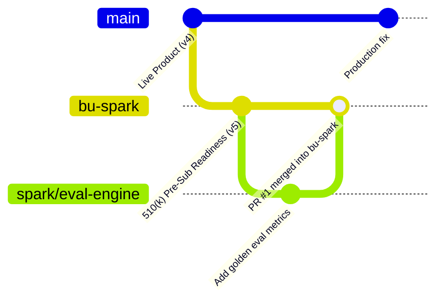

# TraceBridge AI — BU Spark Team Branching & Collaboration Guide

This document defines the Git branching model, development workflow, and safety guidelines for the BU Spark engineering and data science teams collaborating on TraceBridge AI.

---

## 1. Branch Architecture

To protect the live, production-deployed application while enabling rapid student feature development, the repository follows a dual-branch structure:



| Branch | Role | Deployment Target | Access Policy |
| :--- | :--- | :--- | :--- |
| **`main`** | **Production & Live Product** (Version 4 framing / Q-Sub alignment). | Live site (`tracebridge.ai` on Vercel) | **Protected.** Direct pushes discouraged. PRs require review. |
| **`bu-spark`** | **BU Spark Integration Branch** (Version 5/6: 510(k) Pre-submission gap detection & coherence). | Preview environments | **Shared Team Branch.** Students open PRs into this branch. |
| **`spark/<feature>`**| **Student Feature Branches** (created off `bu-spark`). | Local dev / Vercel previews | **Individual / Pair.** Delete branch after merge. |

---

## 2. Developer Quick-Start for BU Spark Students

### Step 1: Clone and Checkout the Project
```bash
git clone https://github.com/tracebridgeai-lab/tracebridge_ai.git
cd tracebridge_ai
npm install
```

### Step 2: Switch to the `bu-spark` Integration Branch
Always base your work off `bu-spark`, **not** `main`:
```bash
git checkout bu-spark
git pull origin bu-spark
```

### Step 3: Create Your Feature Branch
Prefix branch names with `spark/` followed by your initials or feature name:
```bash
# Examples:
git checkout -b spark/rag-evaluation
git checkout -b spark/jh-document-chunking
```

### Step 4: Run the Local Dev Server
```bash
npm run dev
```
Open [http://localhost:3000](http://localhost:3000) to view your changes.

---

## 3. Pull Request (PR) Rules

> [!IMPORTANT]
> **Always set the target base branch to `bu-spark`.**
> Never open a PR directly into `main`. The `main` branch is reserved for production releases.

1. **Verify build and types locally before submitting:**
   ```bash
   npm run build
   ```
2. **Push your branch to GitHub:**
   ```bash
   git push -u origin spark/<your-feature-name>
   ```
3. **Open PR on GitHub:**
   * **Base:** `bu-spark`
   * **Compare:** `spark/<your-feature-name>`
   * **Description:** Detail the problem solved, tests added, and any dataset changes.

---

## 4. Large Dataset & GitHub Guardrails

> [!WARNING]
> GitHub rejects pushes containing individual files larger than **100 MB**. 

* **Filtered 510(k) Corpus (`fda_510k_filtered.jsonl`):**
  * Size: ~509 MB.
  * Stored locally under `spark-deliverables/Evaluation_Dataset/`.
  * **This file is intentionally ignored in `.gitignore`.** Do not force-add (`git add -f`) large JSONL or archive files.
* **Zip & Archive Bundles (`*.zip`, `*.tgz`):**
  * Kept in local storage or shared via Google Drive / BU Spark Slack.
* **Ground Truth Annotations & Mock Documents:**
  * Ground truth answers: [`spark-deliverables/Evaluation_Dataset/annotated_outcomes.json`](file:///Users/176693/tracebridge_ai/spark-deliverables/Evaluation_Dataset/annotated_outcomes.json) (Tracked in Git).
  * Mock PDFs with planted gaps: [`spark-deliverables/Evaluation_Dataset/mock-docs/`](file:///Users/176693/tracebridge_ai/spark-deliverables/Evaluation_Dataset/mock-docs) (Tracked in Git).

---

## 5. Key Documentation References

* **Data Schema & Entity Models:** [`spark-deliverables/Data_Dictionary.md`](file:///Users/176693/tracebridge_ai/spark-deliverables/Data_Dictionary.md)
* **Ground Truth Evaluation Answers:** [`spark-deliverables/Evaluation_Dataset/annotated_outcomes.json`](file:///Users/176693/tracebridge_ai/spark-deliverables/Evaluation_Dataset/annotated_outcomes.json)
* **Product Evolution & Historical Log:** [`scratch/rd_log.md`](file:///Users/176693/tracebridge_ai/scratch/rd_log.md)

---

## 6. Switching Between Live Product and BU Spark

To inspect the live product:
```bash
git checkout main
```

To return to BU Spark development:
```bash
git checkout bu-spark
```
